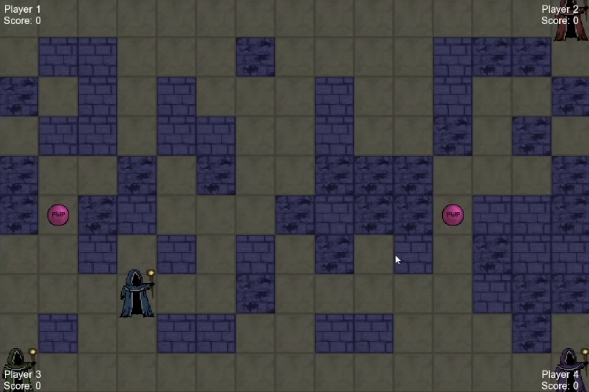

## Overview

**Battle City: Wizards** is a multiplayer old-school 2D arena game where up to four wizards compete to outlast their opponents in a magically trapped battlefield. Each match is a fast-paced duel of strategy, movement, and spellcasting.

## Gameplay

- Up to 4 players, each starting from a different corner of the map.
- Players can move in four directions and cast fireballs to defeat enemies.
- The map is randomly generated at the start of each game and includes:
  - Open paths
  - Breakable and unbreakable walls
  - Hidden magical traps with explosive effects

- When hit by a fireball, a wizard is eliminated.
- The last wizard standing wins.

## Power-ups

Throughout the game, players can collect magical power-ups with unique effects:
- **Shield** – temporary protection
- **Speed** – faster movement
- **Health** – restores a life

## Point System

Players earn points based on their performance in the match.

## Technical Info

- The game follows a **client-server architecture** using **HTTP** and the **Crow** web framework.
- Includes a **Login/Register** system to track individual progress.
- Data is stored using **SQLite** with **SQLite ORM**.
- The game is played through a **console-based client**.

> ⚠️ Note: The server implementation is still in progress.